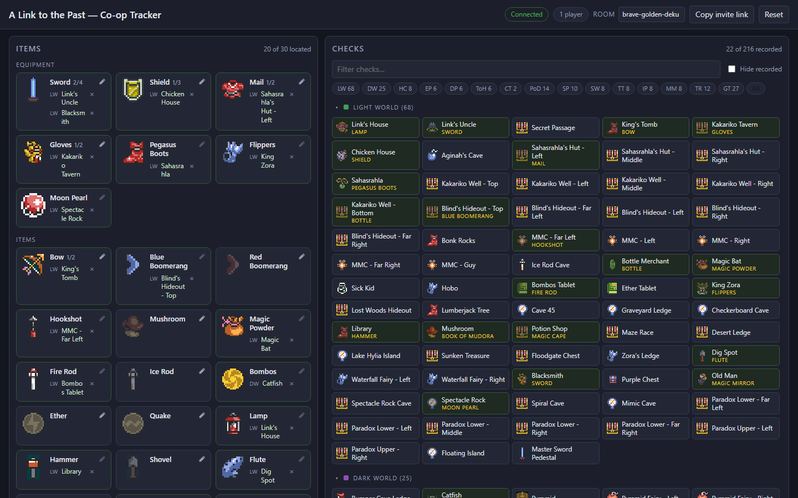

# ALTTP Co-op Tracker

A shared item tracker for co-op *A Link to the Past* runs. One player finds an
item, records **where** it was, and everyone else in the room sees it instantly.

It answers the question that actually comes up mid-run: *"where did we see the
Fire Rod again?"*

## How it works

1. Each of the 32 main items is a sprite tile on the left, with the dungeon
   keys on a **Keys** tab beside them.
2. Click the **item** — anywhere on its tile — and the tracker arms it.
3. Click one of the **216 checks** on the right. Or do it the other way
   round: click the check first, then the item — either order records the
   same thing.
4. The check's name is stored next to the item's sprite as text, and the check
   tile is marked with the item it holds.

Everything is per-room and live: everyone on the same room code sees the same
board over a WebSocket, and rooms are kept in a database, so closing the browser
and coming back later picks the run up where it was.



## Details worth knowing

- **Progressive items have several slots.** Sword holds 4 locations, Shield 3,
  Bottle 4, and Mail, Gloves and Bow 2 each — the Bow's second slot is the
  silver arrows. Heart Container holds 11 and 300 Rupees 4, one per prize in
  the game. These carry a `found/total` counter next to the name,
  green once every slot is placed. Single-slot items simply move when you
  re-assign them; multi-slot items fill up and then say so.
- **A check holds one item.** Assigning an item to a check that already has one
  is refused with a message naming the current holder — clear the old entry
  (the `×` next to it) first. Nobody's note gets silently overwritten.
- **Dead checks.** The small ∅ at the edge of a check tile marks it as holding
  nothing — looked at, and not worth anyone else's time. It dims and drops
  out of "Hide recorded/dead"; click it again to bring it back if that was a
  mistake. A check with an item recorded in it cannot be marked dead, and
  recording an item at a dead check brings it back on its own.
- **Filtering.** Filter by the region chips, or hide checks that are already
  recorded or dead to see what's left. There is nothing to type: the board is
  meant to be worked with one hand while the other stays on the controller.
- **Collapsible regions.** Light World, Death Mountain and Dark World start
  open, the dungeons start folded; click any region header to toggle it.
- **Keys.** The Keys tab is one line per dungeon, big key then small keys, and
  works exactly like the item board — an armed item or check survives the
  switch, so a key can be paired with a check from either tab. Small keys are
  interchangeable, so a dungeon gets one box holding as many locations as it
  has keys — Palace of Darkness 6, Turtle Rock and Ganon's Tower 4, and so on
  (11 big keys and 29 small keys, matching the game). Hyrule Castle and Castle
  Tower have no big key; Eastern Palace has no small keys.
- **Resizable panels.** Drag the seam between the items and the checks to
  give either side more room; double-click it to go back to the default.
  The width is remembered in your browser.
- **Esc** or a **right-click** anywhere cancels an armed item or check.

## Shape of it

One ASP.NET Core app serves everything: the board out of `wwwroot`, the API it
calls, and the websocket it listens on — all the same origin. Postgres holds
both the rooms and the game itself. Everything lives under `source/`, and the
JS in `source/data` is not a server; it is where the game is authored, plus the
tooling that carries it across.

A change is a request to the API, and the API pushes the new state down the
websocket to everyone in that room.

There are no accounts. A room is whoever has its code, so the codes are three
words drawn from a quarter-million combinations, and the API caps requests
and open sockets per client address so that nobody can walk the code space or
fill the database. Opening a code does not create a room — the first recorded
location does — and rooms left empty for a day, or untouched for three months,
are swept away.

## Running it

```sh
dotnet run --project source/AlttpTracker.AppHost
```

Aspire starts Postgres in a container, waits for it, applies any outstanding
migrations, seeds the game, and starts the app. It prints a dashboard URL where
the resources are listed with their addresses — open the `api` one to play.
The dashboard also has a **Run EF migrations** button on the database, for
applying a new migration without cycling the app.

Running the app on its own needs a Postgres to point at:

```sh
ConnectionStrings__tracker="Host=localhost;Database=tracker;Username=postgres;Password=..." \
  dotnet run --project source/AlttpTracker.Api
```

### Tests

```sh
cd source
npm test                                       # game tables and sprites
dotnet test AlttpTracker.Api.Tests             # the room rules, on SQLite
dotnet test AlttpTracker.Api.IntegrationTests   # migrations and indexes, on real Postgres
npm run test:e2e                               # the board in a browser, against the running app
```

The integration tests start their own Postgres with Testcontainers, so they
need Docker running; the first two do not.

The browser tests (Playwright, under `source/e2e`) start the app themselves
and need a Postgres to point it at — by default one on `localhost:5432` with
the password `postgres`, which is what this gives you:

```sh
docker run -d --name tracker-e2e -e POSTGRES_PASSWORD=postgres -p 5432:5432 postgres:17
npx playwright install chromium                # once
```

Set `TRACKER_E2E_CONNECTION` to use a different one. Each test makes its own
room, so a database that has seen earlier runs is fine.

From the board, share the URL from **Copy invite link** with the other players.
Anyone who opens it joins the same board. The room code is in the URL
(`?room=brave-golden-deku`) and can be edited in the header.

## Layout

| Path                                       | What it is                                                |
| ------------------------------------------ | --------------------------------------------------------- |
| `docs/specs/`                              | The specifications: how every part of the tracker behaves |
| `source/data/checks.js`                    | The 216 checks, grouped into 16 regions                   |
| `source/data/items.js`                     | Items and dungeon keys, and how many locations each holds |
| `source/data/sprites.js`                   | Hand-drawn 12x12 pixel art for items and check icons      |
| `source/scripts/export-gamedata.js`        | Carries those three to `gamedata.json` for the API        |
| `source/scripts/build-spritesheet.js`      | Packs the sprite PNGs into one sheet, one CSS class each  |
| `source/test/smoke.test.js`                | Game tables and sprites                                   |
| `source/AlttpTracker.AppHost`              | Aspire: Postgres, the app, and the migrations command     |
| `source/AlttpTracker.Api`                  | The app: board, API, EF model, migrations, websockets     |
| `source/AlttpTracker.Api/wwwroot`          | The board — no build step, no framework                   |
| `source/AlttpTracker.Api.Tests`            | The room rules                                            |
| `source/AlttpTracker.Api.IntegrationTests` | Database behaviour, on real Postgres                      |

### The API

| Route                                            | What it does                    |
| ------------------------------------------------ | ------------------------------- |
| `GET /api/gamedata`                              | Everything the board draws from |
| `GET /api/rooms/new-name`                        | An unused room code             |
| `GET /api/rooms/{room}`                          | The room; empty if never written |
| `POST /api/rooms/{room}/assignments`             | Record an item at a check       |
| `DELETE /api/rooms/{room}/assignments/{id}`      | Clear one location              |
| `PUT /api/rooms/{room}/dead`                     | Mark a check dead, or bring it back |
| `POST /api/rooms/{room}/reset`                   | Clear the room                  |
| `GET /ws?room={room}`                            | Listen for changes              |

## Sprites

The tiles use game sprites from `wwwroot/sprites` where one exists, and fall
back to 12x12 pixel art drawn as character grids in `source/data/sprites.js`,
rendered to inline SVG in the browser.

The individual PNGs in `wwwroot/sprites/items` and `wwwroot/sprites/checks`
are the source, but the board does not fetch them one by one: `npm run
build-sprites` packs them into `wwwroot/sprites/sheet.png` and writes
`sheet.css` with a class per sprite, so the whole board draws from a single
image. Run it after adding or redrawing a sprite and commit both generated
files; `npm test` and CI fail when the sheet is behind its sources. Each check tile gets a glyph based on
what kind of location it is: chest, big chest, NPC, boss drop, tablet, or
freestanding item.

This is a fan-made tool. *The Legend of Zelda: A Link to the Past* and its
artwork belong to Nintendo; nothing here is affiliated with or endorsed by them.
